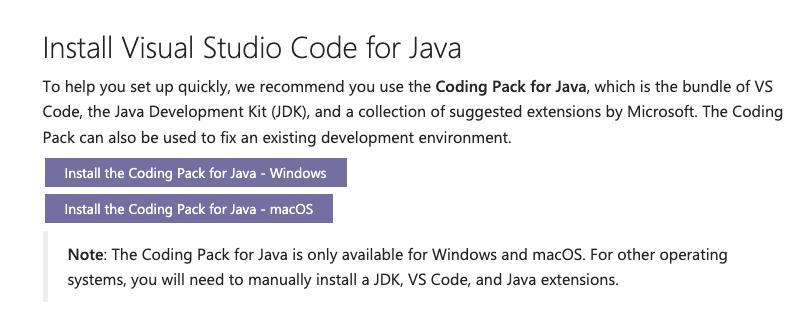

# Java Railway 入門編 テンプレートリポジトリ

このリポジトリは [TechTrain](https://techtrain.dev) が提供する実践問題集 **Java Railway 入門編**に取り組むためのテンプレートリポジトリです。

TechTrainで案内される内容に従い、このリポジトリを使って問題に取り組んでください。


## 開発環境を構築しよう

このリポジトリを使って問題に取り組むために事前に以下のインストールを完了してください

- Git
- Visual Studio Code

### 1. Coding Pack for Java のインストール

Microsoftが公式に提供する開発ツールを利用します。
Visual Studio Code で Java 開発を行うために Microsoft が公式に提供している Coding Pack for Java をインストールします。
インストールの詳細については以下のリンクを参考にしてください。

[Install Visual Studio Code for Java](https://code.visualstudio.com/docs/languages/java#_install-visual-studio-code-for-java)

ここでは、セットアップについての簡易的な説明を行います。

1.  [Install Visual Studio Code for Java](https://code.visualstudio.com/docs/languages/java#_install-visual-studio-code-for-java) にアクセスします
2.  ページ内の "Install the Coding Pack for Java" のボタンをクリックします。Windows、macOSそれぞれのボタンが用意されていますので、ご利用のOSに合わせて選択してください。
  
3.  ダウンロードしたファイルを実行し、インストールを行います。Windowsの場合は `JavaCodingPack-<version>.exe` というファイルがダウンロードされますので、"Windowsの場合" の説明に従ってインストールしてください。macOSの場合は `JavaCodingPack-<version>.zip` というファイル名でダウンロードされますので、zipを展開してください。`Coding Pack for Java` アプリケーションが展開されます。"macOSの場合" の説明に従ってインストールしてください。


#### Windowsの場合

// TODO

#### macOSの場合

1. Coding Pack for Java アプリケーションを実行します
2. 「"Coding Pack for Java" はインターネットからダウンロードされたアプリケーションです。開いてもよろしいですか？」というメッセージが表示される場合があります。この場合は「開く」をクリックしてください。
3. インストーラーが起動しますので、指示に従ってインストールを完了してください。インストール中にパスワードの入力が求められる場合がありますので、ご使用のコンピューターのパスワードを入力してください。
   


### 2. Maven のインストール

1. Apacheの [Maven公式ページ](https://maven.apache.org/download.cgi) にアクセスします 
2. ページ内の "Files" から最新のバージョンの `Binary zip archive` をダウンロードします

3. 以降の手順は Windows と macOS で異なりますので、それぞれの手順に従ってインストールを行ってください

#### Windowsの場合

// TODO なんかいい感じのスクリプトファイルを作って対応したい

#### macOSの場合

// TODO なんかいい感じのスクリプトファイルを作って対応したい

### 3. GitHubのリポジトリをフォークする

1. GitHubにログインします。アカウントをお持ちでない場合は新たに作成してください。
2. このリポジトリをフォークします。リポジトリの右上にある「Fork」ボタンをクリックしてください。
3. フォークが完了すると、あなたのGitHubアカウントにこのリポジトリのコピーが作成されます。
4. あなたのGitHubアカウントに作成されたリポジトリをローカルにクローンします。
5. ターミナルを開き、以下のコマンドを実行してください。`{username}` はあなたのGitHubのユーザ名に置き換えてください。
  ```bash
  git clone https://github.com/{username}/java-stations.git
  ```
6. クローンが完了すると、`java-stations` というディレクトリが作成されます。このディレクトリがこのリポジトリのローカルリポジトリです。
7. `java-stations` ディレクトリに移動し、Visual Studio Code で開いてください。
  ```bash
  cd java-stations
  code .
  ```
8. Visual Studio Code が起動し、`java-stations` ディレクトリが開かれます。

### 4. TechTrain Railway の VSCode Extension をインストールする

1. Visual Studio Code を開いてください
2. 左側のアクティビティバーから「Extensions」をクリックしてください
3. 検索バーに `TechTrain Railway` と入力してください
4. TechTrain Railway の拡張機能が表示されるので、インストールボタンをクリックしてください
5. インストールが完了すると、左側のアクティビティバーに TechTrain Railway のアイコンが表示されます
6. TechTrain Railway のアイコンをクリックすると、ログインが要求されますので、TechTrainにご登録のIDとパスワードでログインします。
7. ログインに成功すると、該当するRailwayの内容が表示されます。以上で、TechTrain Railway のVSCode Extension のインストールが完了です。

### 5. Extension Pack for Java のインストール

Extension Pack for Java は、Java開発に必要な拡張機能をまとめて提供する拡張機能パックです。Java開発に必要な拡張機能がまとめてインストールされるため、Java開発環境のセットアップが簡単に行えます。

1. Visual Studio Code を開いてください
2. 左側のアクティビティバーから「Extensions」をクリックしてください
3. 検索バーに `Extension Pack for Java` と入力してください
4. Extension Pack for Java の拡張機能が表示されるので、インストールボタンをクリックしてください

### 6. 最後に

以上で開発環境のセットアップが完了しました。問題に取り組む準備が整いましたので、TechTrainの指示に従って問題に取り組んでください。

問題に取り組み、Stationごとの課題が完成したら、TechTrain Railwayに表示されている "できた" ボタンをクリックして合格判定を実行しましょう。
